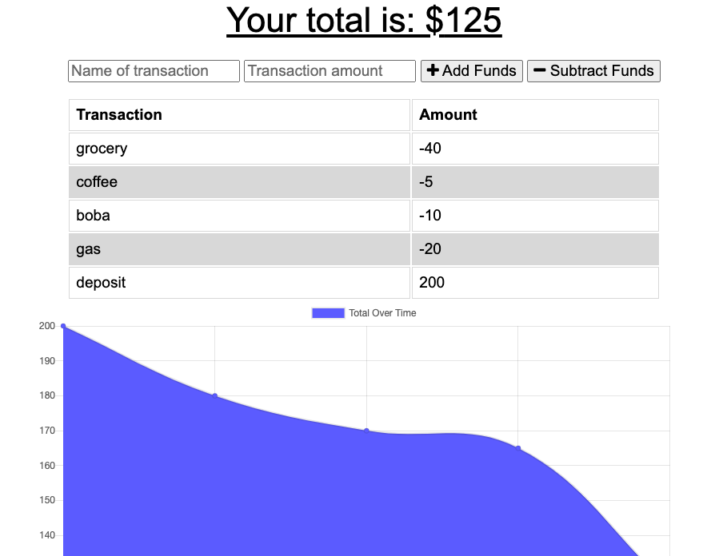

# Budget Tracker with PWA

### Description 
Budget tracker application allows user to monitor their budget. User can add and subtract funds over time. 

### Installation
`npm install` to install all dependencies

### Usage
1. `npm start` to start the server 

### Usage

Heroku: https://budget-trackr-an.herokuapp.com/

### Technology
* Node.js
* MongoDB
* Express.js
